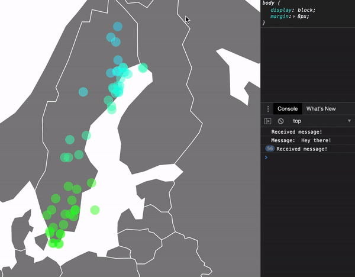

# ID2221: Final Project

This is the final project of the KTH course [Data-Intensive Computing (ID2221)](https://www.kth.se/student/kurser/kurs/ID2221?l=en). We were able to choose the topic freely with the goal of computing data in a distributed manner.

## Introduction

Due to geographical or urban conditions, weather stations are not distributed perfectly equally across countries. For the same reasons, weather stations are not to be found on every inch on a given piece of land. When creating heat maps for countries however, it is required to calculate a value for every single pixel of the map. Also, since heat maps are meant to show continuous color flows, the calculated temperature values cannot simply assume the temperature of the next weather station but must evaluate temperatures of different weather stations around it.

Given live data in Sweden from **Open Weather Map**, we aim to create a live heat map, where every pixel represents a calculated temperature. Since we don't have direct access to the weather station temperatures, but can on the other hand query city temperatures, we pretend that every city acts as a single weather station for our data input.

We believe this is a good topic, since temperature data is available in abundance and is constantly changing, making it a good use-case for big-data streams.

## Demo



## Data

- [A real-time feed with Open Weather](https://openweathermap.org/api/one-call-api?gclid=CjwKCAjw8MD7BRArEiwAGZsrBZAziHCpMkeqY-7OeABUvfzM1O7ptpy66WoekfnVP_6Cin58VQWMWRoC63IQAvD_BwE)

## Components

The components we used were:

- A **Kafka Producer**, which would constantly query Open Weather Data and push it towards the topic "city-temperatures"

- **Spark Streaming**, which would

    1. Listen to the Kafka's "city-temperatures" with a **Kafka Consumer**
    2. Save it **Cassandra**
    3. Define a block around the newly fetched city and query all cities temperatures inside it
    4. Create a fine grid within the block
    5. Calculate the temperature in every grid point, using all the queried city-temperatures and their distances towards the given grid point
    6. Push the grid to the Kafka topic "grid-temperatures", using another **Kafka Producer**

- **Cassandra**, which would store all the city temperatures, whereby a composite primary key of latitude & longitude were used

- **NodeJS server**, which would

    1. Listen to Kafka's "grid-temperatures" with a **Kafka Consumer**
    2. Listen to a http server as well as a websocket (ws)
    3. Serve the main web-page index.html with a **D3.js** visualisation.
    4. Let index.html and it's websocket communicate, so that every Kafka update could be forwarded the visualisation.

## Problems we ran into

Unfortunately, it turned out that doing calculations in Spark Streaming was more difficult than expected. More specifically, we were not able to calculate the grid temperatures in our blocks whenever we had a weather-station update. This was due to the following factors:

1. A DStream consists of multiple rdds. We wanted to perform calculations using Spark Datasets for every single temperature update. This meant that we had to do multiple calculations for every DStream.

2. Non DStream-related code is only executed once in Spark Streaming. So the only chance of doing something continuously is through DStream.map() or DStream.foreachRDD().

3. It is not possible to create rdds from a worker („nested rdds“). That meant that we could not load our data from Cassandra into a (distributed) Dataset/Dataframe within a DStream.map()/.foreachRDD() operation. When passing the SparkSession to the workers, we would receive a NullPointerException.

It seemed to us that this meant that we would have to query the data from Cassandra to each worker locally, using a local Cassandra session and neither a Spark DataFrame or DataSet (which would try to distribute the data). Without knowing what other open-source frameworks exist, we were quite sure that querying and analyzing the data with CSQL would be quite complicated. Furthermore, in real scenarios, this would potentially also overload the worker with data and defeat the point of having distributed nodes. We did not implement this, since we also felt that it would miss the purpose of the course.

## Build and Run with Docker

1. Build and run with docker-compose

    ```bash
        docker-compose up --build
    ```

2. Visit [localhost:8001](http://localhost:8001) and look at Sweden.

## Useful Links

- [D3.js Tutorial for Maps](https://lenses.io/blog/2019/11/visualize-spatial-data-from-apache-kafka-with-d3/)
